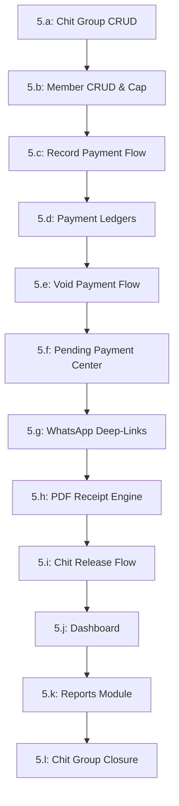

# ChitLedger Implementation Plan

This document outlines the step-by-step implementation plan for the Chit Fund Management System (**ChitLedger**). The build sequence enforces a data-first approach: database schema integrity, authorization logic, and backend security are fully completed and verified before any frontend user interface scaffolding begins.

---

## User Review Required

> [!IMPORTANT]
> **Build Sequence Ordering**: UI screens will only be generated against already active and verified database tables and RPC policies. This guarantees that frontend views never drift from the underlying database models.

> [!WARNING]
> **Row-Level Security (RLS) Verification Prerequisite**: Before building any frontend routes, a manual verification test of the database using the public anonymous key must confirm that unauthorized reads/writes are strictly blocked by Supabase.

---

## Implementation Phases

### Phase 1: Project Scaffolding & Setup
* **Dependencies**: None
* **Deliverables**:
  - Initialize Git repository and link to remote repository.
  - Create the React + TypeScript frontend scaffold using Vite:
    ```bash
    npx -y create-vite@latest chitledger --template react-ts
    ```
  - Install Tailwind CSS and initialize shadcn/ui primitives.
  - Create the local `.env` configuration file containing public Supabase credentials:
    * `VITE_SUPABASE_URL`
    * `VITE_SUPABASE_ANON_KEY`
* **Definition of Done**:
  - The React application compiles cleanly and runs locally via `npm run dev` displaying a default home screen.
  - The `.env` file contains valid client configurations.

---

### Phase 2: Database Setup & RLS Hardening
* **Dependencies**: Phase 1
* **Deliverables**:
  - Run the database migration script against the remote Supabase project `wnteyyiwkatfmhqcmhzy`. This migration creates all enums, tables, check constraints, foreign keys, indexes, trigger functions, views, and SECURITY DEFINER RPCs (`record_payment`, `void_payment`).
  - Seed the database with the single row in `admin_settings` containing:
    * `id`: `'00000000-0000-0000-0000-000000000001'`
    * `business_name`: `'ChitLedger Admin'`
    * `admin_email`: `'admin@chitledger.com'`
    * `whatsapp_template_en`: `'Dear {member_name}, your installment for {month} is due. Total due: {total}.'`
    * `whatsapp_template_te`: `'ప్రియమైన {member_name}, మీ {month} వాయిదా చెల్లించాల్సి ఉంది. మొత్తం: {total}.'`
  - Seed the Supabase Auth user `admin@chitledger.com` with a secure password.
  - Apply the REVOKE/GRANT statements on all functions and trigger functions to secure executions.
  - **Manual RLS Verification Test**: Run a local test script or Postman request querying `public.customers` and `public.chit_groups` using only the public anon key. The database must return `401 Unauthorized` or `403 Forbidden` and block all access.
* **Definition of Done**:
  - The Supabase migration completes without error.
  - The manual anonymous-key test succeeds by confirming that database reads are completely blocked when a valid admin JWT is missing.

---

### Phase 3: Admin Authentication & Routing
* **Dependencies**: Phase 2
* **Deliverables**:
  - Secure Login screen (`/`) built with shadcn/ui form elements, integrated with Supabase Auth (`signInWithPassword`).
  - React Router configuration defining protected routes (`/dashboard`, `/pending`, `/groups`, etc.) that redirect unauthorized users back to `/`.
  - Global Axios/Supabase client interceptor that catches 401 Unauthorized token-expiry errors, displays an overlay modal warning the user, and safely routes back to `/`.
  - Password recovery screens (`/reset-password`).
* **Definition of Done**:
  - I can log in using `admin@chitledger.com`, get redirected to `/dashboard`, and confirm the session JWT is saved.
  - Attempting to visit `/dashboard` while logged out instantly redirects back to `/`.
  - Simulating a expired session triggers the warning modal and redirects the viewport to the login page on dismissal.

---

### Phase 4: App Shell & Mobile-First Navigation
* **Dependencies**: Phase 3
* **Deliverables**:
  - Global page layout containing responsive navigation elements:
    * **Mobile viewport (<768px)**: Bottom tab bar featuring Dashboard, Pending, Groups, and a "More" menu button. Clicking "More" slides up a sheet displaying Payments, Members, Releases, Reports, and Settings.
    * **Desktop viewport (>=768px)**: Persistent left sidebar showing all application links.
  - Base typography rules, colors, and minimum 44px hit-targets defined in `index.css`.
* **Definition of Done**:
  - Resizing the browser window to mobile widths shows the bottom tab bar and hides the sidebar, while desktop widths render the sidebar.
  - Clicking the bottom bar options navigates between empty page slots cleanly.
  - Tapping "More" on mobile successfully presents the sheet menu overlay.

---

### Phase 5: Core Features Implementation
Each feature component will be built, manually tested against its acceptance criteria, and verified before the next sub-phase starts.



#### 5.a: Chit Group CRUD
* *Deliverables*: Group listing table at `/groups` (Active vs Archived tabs), Create Group drawer modal (Name, Chit Pool, Durations, Installment, Penalty Rate, Grace Period, Start Date), Edit Group modal.
* *Definition of Done*: I can create an active group, verify it appears in the Active list, and open the Edit modal to verify only the Name and Grace Period fields can be modified (others are locked and read-only).

#### 5.b: Member CRUD & Capacity Enforcements
* *Deliverables*: Global member table at `/members`, Add Member modal.
* *Definition of Done*: I can add a member with an Indian E.164 phone number, verify a warning banner appears when inputting a duplicate phone number, and confirm that trying to add a 31st member to a group fails with a capacity constraint message.

#### 5.c: Record Payment Flow & Dynamic Calculations
* *Deliverables*: Record Payment modal, Indian currency formatter utility (`Intl.NumberFormat`), timezone-locked IST calculations.
* *Definition of Done*: Selecting a member and overdue month in the payment modal displays the correct linear penalty calculation formatted in Indian style (e.g. ₹5,00,000). Inputting an incorrect amount blocks submission, while entering the exact expected total succeeds.

#### 5.d: Member Detail & Payment History Ledgers
* *Deliverables*: Global history view at `/payments`, individual ledger view at `/members/:id`.
* *Definition of Done*: Tapping a payment row in the mobile view expands it to display full details, and all values render in lakh/crore Indian format.

#### 5.e: Void Payment Flow
* *Deliverables*: Red-themed Void confirmation modal, RPC execution, audit badges.
* *Definition of Done*: I can click Void on a payment row, type a mandatory reason, and confirm. The row updates with a strike-through style and a red `VOIDED` badge.

#### 5.f: Pending Payment Center
* *Deliverables*: `/pending` cross-group overview displaying unpaid cycles.
* *Definition of Done*: The table displays all overdue cycles. Clicking "Record Payment" on an entry launches the payment modal pre-filled with that member and month.

#### 5.g: WhatsApp Reminder Deep-Links
* *Deliverables*: Template replacements, zero-penalty logic, wa.me redirection.
* *Definition of Done*: Clicking "Send Reminder" on a row with 0 penalty opens `wa.me` in a new tab with the penalty sentence stripped from the message template.

#### 5.h: PDF Receipt Generation
* *Deliverables*: Client-side PDF generation service, auto-download trigger.
* *Definition of Done*: Recording a payment automatically prompts a browser download of a branded `Receipt_RCT-YYYY-NNNN.pdf`. Clicking the manual download button on a historical payment row triggers the identical file download.

#### 5.i: Chit Release Flow
* *Deliverables*: Record Release modal, outstanding dues check warning.
* *Definition of Done*: Selecting a member who has outstanding dues displays a yellow warning. The Submit button remains locked until I manually tick the authorization checkbox.

#### 5.j: Dashboard Metrics & Charts
* *Deliverables*: KPI summaries, Recent activity feed, 3 Recharts graphics.
* *Definition of Done*: The dashboard correctly displays active group/member counts, monthly collections, and renders three charts displaying historical collection trends.

#### 5.k: Reports Module
* *Deliverables*: `/reports` page, 6 selectable tabular reports, PDF exporter button.
* *Definition of Done*: Selecting the "Defaulters List" report compiles all overdue members on-screen. Clicking "Generate PDF" downloads a printable document of the list.

#### 5.l: Chit Group Closure Flow
* *Deliverables*: Close Group button on `/groups/:id`, name-match confirmation modal.
* *Definition of Done*: Clicking Close Group, typing the exact group name, and confirming updates the status to `archived`, locks all payment/release buttons, and moves the group to the Archived list tab.

---

### Phase 6: Edge Cases & Validation Hardening
* **Dependencies**: Phase 5
* **Deliverables**:
  - Frontend checks to handle edge cases: double-payment in the same month (handled by DB index), voiding already voided payments, stale total-due rollover handling.
* **Definition of Done**:
  - Attempting to record two payments for the same member and installment month throws a unique constraint error.
  - Opening the Record Payment modal and waiting past a timezone rollover displays the updated total validation warning on submit.

---

### Phase 7: Concurrency & Stress Testing
* **Dependencies**: Phase 6
* **Deliverables**:
  - Test script/simulation executing simultaneous concurrent transactions.
* **Definition of Done**:
  - Simulating 2 rapid payment submissions within the same second completes successfully, generating consecutive receipt numbers (e.g. `RCT-2026-0001` and `RCT-2026-0002`) with no skips or duplicate receipt numbers.

---

### Phase 8: Production Deployment
* **Dependencies**: Phase 7
* **Deliverables**:
  - Vercel production hosting setup.
  - Production Supabase database instance created.
  - Environment variables configured in Vercel.
* **Definition of Done**:
  - The production URL loads the login page, allows logging in, and connects to the production database securely.

---

### Phase 9: Performance Polish & Client Walkthrough
* **Dependencies**: Phase 8
* **Deliverables**:
  - Responsiveness optimizations for mobile views.
  - Client walkthrough check-off.
* **Definition of Done**:
  - All tabular pages display and scroll smoothly on mobile screen emulators.
  - Client completes a live test recording a payment and downloading a receipt in under 15 seconds.

---

## Verification Plan

### Automated Verification
* Run the concurrent receipt sequence check using a node script located at `src/lib/test-concurrency.ts` executing parallel promises:
  ```bash
  npm run test-concurrency
  ```

### Manual Verification
* Perform a full walkthrough checklist:
  1. Attempt anonymous read of `chit_groups` table (must fail).
  2. Log in as admin, check KPI aggregates on dashboard.
  3. Create group -> Add member -> Verify max capacity of 30.
  4. Record an overdue payment -> Check penalty calculations -> Confirm PDF automatically downloads.
  5. Close group -> Verify write actions are disabled.
